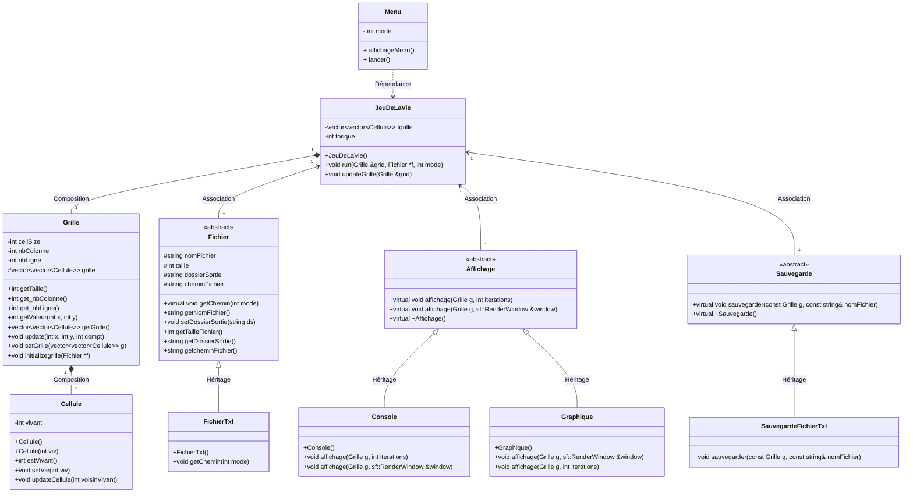
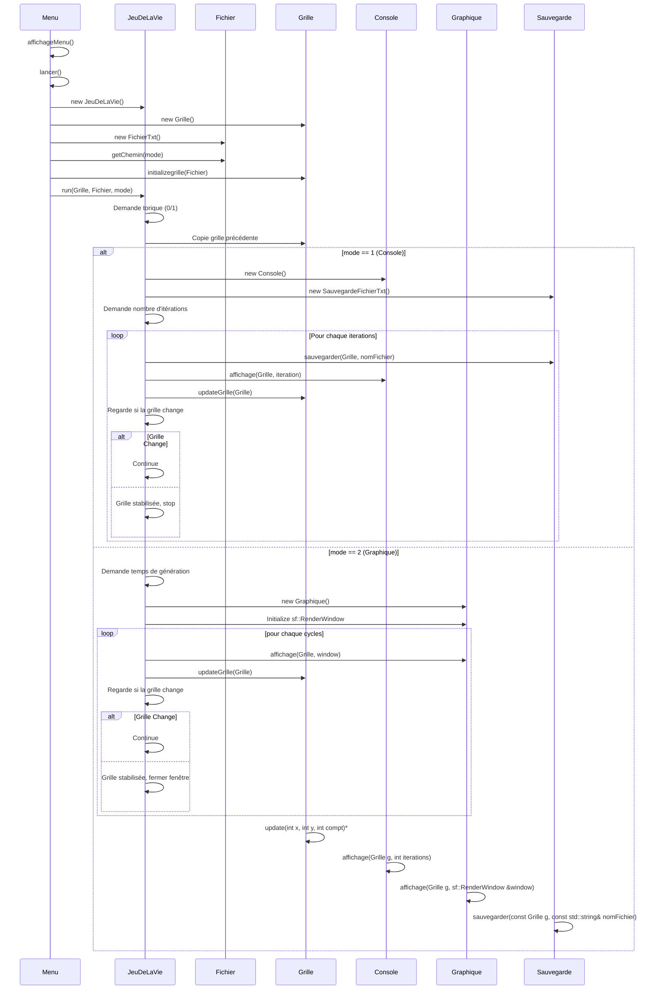
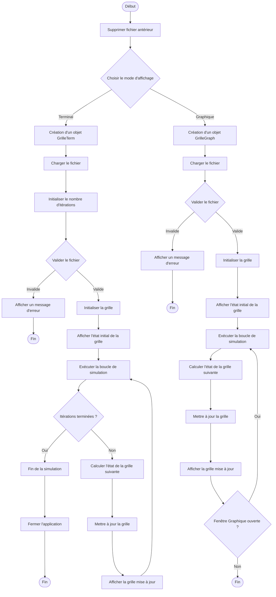

---

# 🌱 Jeu de la vie - Projet POO

Le programme est une implémentation en C++ de l'automate cellulaire "Jeu de la vie" de Conway, développé dans le cadre du projet Programmation Orientée Objet (POO). Il permet de simuler l'évolution de cellules sur une grille selon des règles simples mais qui peuvent vite donner des comportements intéressants.


# 🎮 DOCUMENTATION UTILISATEUR


## Sommaire

- [🌱 Jeu de la vie - Projet POO](#-jeu-de-la-vie---projet-poo)
- [🎮 DOCUMENTATION UTILISATEUR](#-documentation-utilisateur)
  - [Sommaire](#sommaire)
    - [📋 Présentation du Jeu de la vie](#-présentation-du-jeu-de-la-vie)
    - [📐 Règles du Jeu](#-règles-du-jeu)
    - [🚀 Modes de lancement](#-modes-de-lancement)
    - [🔧 Instructions d'utilisation](#-instructions-dutilisation)
      - [Pré-requis](#pré-requis)
    - [🚀 Installation](#-installation)
      - [Environnement de développement](#environnement-de-développement)
      - [Dépendances](#dépendances)
      - [Clonage et compilation](#clonage-et-compilation)
    - [📦 Utilisation du Makefile](#-utilisation-du-makefile)
      - [📁 Organisation des fichiers](#-organisation-des-fichiers)
    - [🎮 Étapes pour Lancer le programme](#-étapes-pour-lancer-le-programme)
      - [1. Choix du Mode](#1-choix-du-mode)
      - [2. Sélection du fichier d'entrée](#2-sélection-du-fichier-dentrée)
      - [3. Configuration de la grille](#3-configuration-de-la-grille)
    - [🖥️ Mode Terminal](#️-mode-terminal)
    - [🖼️ Mode Graphique](#️-mode-graphique)
    - [✨ Fonctionnalités générales](#-fonctionnalités-générales)
    - [🛠️ Extensions, conseils \& astuces](#️-extensions-conseils--astuces)
- [DOCUMENTATION TECHNIQUE](#documentation-technique)
  - [Introduction](#introduction)
    - [Structure du document](#structure-du-document)
  - [Architecture du Projet](#architecture-du-projet)
    - [Vue d'ensemble](#vue-densemble)
    - [Couches d'abstraction](#couches-dabstraction)
      - [IHM (Interface Homme-Machine)](#ihm-interface-homme-machine)
      - [Logique](#logique)
      - [Données](#données)
      - [Les Tests Unitaires (optionnel)](#les-tests-unitaires-optionnel)
  - [UML](#uml)
    - [Diagramme de cas d'utilisation](#diagramme-de-cas-dutilisation)
    - [Diagramme de classes](#diagramme-de-classes)
      - [1. Cellule](#1-cellule)
      - [2. Grille](#2-grille)
      - [3. Affichage (Classe Abstraite)](#3-affichage-classe-abstraite)
      - [4. Fichier (Classe Abstraite)](#4-fichier-classe-abstraite)
      - [5. Sauvegarde (Classe Abstraite)](#5-sauvegarde-classe-abstraite)
      - [6. JeuDeLaVie](#6-jeudelavie)
      - [7. Menu](#7-menu)
      - [Polymorphisme par héritage](#polymorphisme-par-héritage)
      - [Composition](#composition)
      - [Abstraction](#abstraction)
      - [Avantages de l'architecture](#avantages-de-larchitecture)
    - [Diagramme de séquence](#diagramme-de-séquence)
      - [Grands axes](#grands-axes)
    - [Diagramme d'activité](#diagramme-dactivité)
  - [Détails de l'Implémentation](#détails-de-limplémentation)
    - [IHM (Interface Homme-Machine)](#ihm-interface-homme-machine-1)
      - [Classe `Affichage`](#classe-affichage)
      - [Classe `Console`](#classe-console)
      - [Classe `Graphique`](#classe-graphique)
    - [Logique](#logique-1)
      - [Classe `JeuDeLaVie`](#classe-jeudelavie)
      - [Classe `Fichier`](#classe-fichier)
      - [Classe `Sauvegarde`](#classe-sauvegarde)
      - [Classe `SauvegardeFichierTxt`](#classe-sauvegardefichiertxt)
    - [Données](#données-1)
      - [Classe `Grille`](#classe-grille)
      - [Classe `Cellule`](#classe-cellule)
  - [Choix de Conception et Justification](#choix-de-conception-et-justification)
    - [Héritage](#héritage)
    - [Polymorphisme](#polymorphisme)
    - [Généricité](#généricité)
    - [Autres choix de conception](#autres-choix-de-conception)
  - [Tests et Validation](#tests-et-validation)
    - [Tests unitaires](#tests-unitaires)
    - [Vidéo d'exemple et validation des fonctionnalités](#vidéo-dexemple-et-validation-des-fonctionnalités)
    - [Affichage de la validation des tests :](#affichage-de-la-validation-des-tests-)
  - [Conclusion](#conclusion)
    - [Résumé des points clés](#résumé-des-points-clés)
    - [Perspectives d'amélioration](#perspectives-damélioration)
  - [👥 Contributeurs](#-contributeurs)
  - [Références](#références)

### 📋 Présentation du Jeu de la vie

Le **Jeu de la vie**, créé par John Conway en 1970, est un automate cellulaire où des cellules vivantes ou mortes évoluent sur une grille en fonction de leurs voisines. Ce modèle simule des phénomènes émergents, illustrant comment des règles simples engendrent des comportements complexes.

---

### 📐 Règles du Jeu

1. **Naissance** : Une cellule morte avec exactement **3 voisines vivantes** devient vivante.
2. **Surpopulation** : Une cellule vivante avec plus de **3 voisines vivantes** meurt.
3. **Sous-population** : Une cellule vivante avec moins de **2 voisines vivantes** meurt.
4. **Survie** : Une cellule vivante avec **2 ou 3 voisines vivantes** reste vivante.

---

### 🚀 Modes de lancement

Le programme propose deux modes principaux :

- **Mode Terminal** : Affichage textuel pour une utilisation rapide.
- **Mode Graphique** : Visualisation dynamique avec l'interface **SFML** pour un rendu immersif.

---

### 🔧 Instructions d'utilisation

#### Pré-requis
Assurez-vous d'avoir les dépendances nécessaires :
- **Compilateur C++ (gcc/g++)**
- **SFML** (pour le mode graphique)

### 🚀 Installation

#### Environnement de développement

Pour compiler et exécuter le programme, vous aurez besoin des éléments cités précédemment.

#### Dépendances

Sous Ubuntu, les dépendances nécessaires peuvent être installées avec les commandes suivantes :

```bash
sudo apt-get update
sudo apt-get install g++ libsfml-dev make
```


#### Clonage et compilation

1. **Clonez le dépôt Git du projet** :

   ```bash
   git clone https://github.com/DotV4pe/LeJeuDeLaVie.git
   ```

2. **Naviguez jusqu'au répertoire du projet** :

   ```bash
   cd LeJeuDeLaVie
   ```

  
### 📦 Utilisation du Makefile

Le **Makefile** simplifie la compilation et l'exécution du programme. Voici les commandes disponibles :

- **Compilation** : 
  ```
  make
  ```
  Cette commande génère un exécutable nommé `main`.

- **Nettoyage des fichiers compilés** :
  ```
  make clean
  ```
  Supprime les fichiers objets et l'exécutable pour une recompilation propre.

- **Exécution** :
  ```
  ./main
  ```
  Lance le programme interactif.

---

#### 📁 Organisation des fichiers

Votre programme utilise des fichiers pour initialiser l'état des cellules. Vous devrez fournir un fichier texte contenant une grille de cellules (vivantes `1` ou mortes `0`). La première ligne permettra de spécifier la taille de la grille (hauteur & largeur) comme suit :
```
5 10
0 0 1 0 0 0 0 0 0 0
0 0 0 1 0 0 0 0 0 0
0 1 1 1 0 0 0 0 0 0
0 0 0 0 0 0 0 0 0 0
0 0 0 0 0 0 0 0 0 0
```
Ici, `1` représente une cellule vivante, et `0` une cellule morte.

⚠ Lorsque vous voulez importer un fichier comportant une matrice et sa taille, veuillez l'intégrer dans le dossiers `Matrices`. Sinon, le fichier d'entrée ne pourra pas être lu. ⚠

---

### 🎮 Étapes pour Lancer le programme

#### 1. Choix du Mode
Au lancement, choisissez le mode de visualisation :
- **1** : Mode Terminal
- **2** : Mode Graphique
- **0** : Quitter

#### 2. Sélection du fichier d'entrée
Indiquez le fichier d'état initial des cellules **sans son extension**. Exemple :
```
Veuillez renseigner votre fichier : data
```

#### 3. Configuration de la grille
Définissez si la grille doit être **torique** :
```
Voulez-vous une grille torique :
0. Oui
1. Non
```

---

### 🖥️ Mode Terminal

1. **Définissez le nombre de cycles** :
   ```
   Nombre de cycles du jeu de la vie : 5
   ```

2. **Visualisation** :
   Les cycles sont affichés dans le terminal, et les fichiers texte correspondants sont enregistrés dans un dossier de sortie.

---

### 🖼️ Mode Graphique

1. **Configurez la vitesse** :
   Définissez le délai (en millisecondes) entre chaque cycle d'affichage :
   ```
   Entrez le temps de génération de chaque cycle (en ms) : 1000
   ```

2. **Visualisation graphique** :
   Regardez l'évolution des cellules en temps réel grâce à l'interface graphique.

---

### ✨ Fonctionnalités générales

- **Gestion automatique des dossiers** : Le programme crée et nettoie automatiquement les dossiers/fichiers nécessaires. En utilisant le mode terminal, vous pourrez retrouver vos fichiers dans un dossier nommé de la forme suivante : `<nom_du_fichier_dentree>_out`.
- **Fichiers générés** : Chaque cycle est enregistré dans un fichier texte nommé de la forme `cycle_<n°_révision>.txt`, ce qui permet d'analyser ou de rejouer les simulations.
- **Extensions des obstacles** : Le programme intègre une extension où vous pouvez choisir un obstacle (statique) qui peut agir comme une cellule morte (`2`) ou comme une cellule vivante (`3`).

---

### 🛠️ Extensions, conseils & astuces

- **Fichiers d'entrée** : Vérifiez que vos fichiers contiennent uniquement des `0`, `1`, `2` ou `3`.
- **Performance** : Le mode graphique peut être gourmand en ressources pour des grilles de grande taille. Préférez le mode terminal pour des simulations rapides.

---


# DOCUMENTATION TECHNIQUE


## Introduction

### Structure du document
Ce document est structuré en plusieurs sections pour faciliter la compréhension et l'utilisation du code. Il inclut une vue d'ensemble de l'architecture, des détails d'implémentation, des choix de conception, et des informations sur la compilation et l'exécution.

## Architecture du Projet

### Vue d'ensemble
Le projet est divisé en trois couches principales : l'IHM, la logique, et les données. Chaque couche a un rôle spécifique et est conçue pour minimiser les dépendances entre elles.


<p align="center">
    
</p>

---

### Couches d'abstraction

#### IHM (Interface Homme-Machine)
- **Classe `Affichage`** : Classe mère pour les affichages.
- **Classe `Console`** : Affichage textuel.
- **Classe `Graphique`** : Affichage graphique.
- **Classe `Menu`** : Permet de créer le Jeu de la Vie.

#### Logique
- **Classe `JeuDeLaVie`** : Gestion de la simulation.
- **Classe `Fichier`** : Gestion des fichiers.
- **Classe `FichierTxt`** : Gestion des fichiers textes.
- **Classe `Sauvegarde`** : Sauvegarde des états.
- **Classe `SauvegardeFichierTxt`** : Sauvegarde dans des fichiers texte.

#### Données
- **Classe `Grille`** : Représentation de la grille.
- **Classe `Cellule`** : Représentation des cellules.

#### Les Tests Unitaires (optionnel)
- **Classe `FichierTest`** : Comporte des méthodes testant la classe
- **Classe `Test`** : Permet de lancer et valider ou non les tests unitaires.

---
## UML

### Diagramme de cas d'utilisation


Le diagramme de cas d'utilisation nous aide à observer les principaux cas d'utilisation de notre Jeu. Les principales fonctionnalités sont les suivantes

- Démarrer un nouveau jeu
- Choix du fichier d'entrée
- Lancement du mode graphique
- Lancement du mode terminal
- Intégrer de nouveaux modèles à l'aide de raccourcis clavier
- Visualiser les cellules vivantes, les cellules mortes et les obstacles
- Choisir le nombre d'itérations
- Sauvegarder le jeu en générant des fichiers de sortie

Les principaux choix de conception sont les suivants :

- Séparer les modes graphique et terminal pour prendre en charge les différentes préférences des utilisateurs et les différents cas d'utilisation.
- Permettre aux utilisateurs de personnaliser le jeu en intégrant de nouveaux modèles
- Fournir des fonctions de visualisation pour suivre l'évolution du jeu
-Permettre aux utilisateurs de contrôler la durée de la simulation en définissant le nombre d'itérations.
- Sauvegarder l'état du jeu pour le retrouver plus tard

---

### Diagramme de classes

Le diagramme de classe suivant modélise le programme implémenté. 


#### 1. Cellule
- **Rôle** : Représente l'unité de base du jeu
- **Attributs** : État (vivant/mort + obstacles pour l'extension)
- **Méthodes** : 
  - Vérifier l'état
  - Mettre à jour l'état selon les voisins

#### 2. Grille
- **Rôle** : Conteneur et gestionnaire des cellules
- **Caractéristiques** :
  - Stockage des cellules
  - Gestion des dimensions
  - Initialisation et mise à jour des cellules

#### 3. Affichage (Classe Abstraite)
- **Concept** : Polymorphisme d'affichage
- **Implémentations** : 
  - Console : Affichage texte
  - Graphique : Affichage graphique SFML

#### 4. Fichier (Classe Abstraite)
- **Rôle** : Gestion générique des fichiers
- **Fonctionnalités** :
  - Définition de chemins
  - Gestion des fichiers de sortie

#### 5. Sauvegarde (Classe Abstraite)
- **Rôle** : Abstraction de la sauvegarde
- **Implémentation** : 
  - Sauvegarde en fichier texte

#### 6. JeuDeLaVie
- **Rôle** : Coordinateur principal
- **Responsabilités** :
  - Évolution de la grille
  - Interaction entre composants

#### 7. Menu
- **Rôle** : Interface utilisateur
- **Fonctions** : 
  - Lancement du jeu
  - Gestion des modes

Grâce à ce choix d'architecture, le diagramme de classe est défini en fonction des bonnes pratiques suivantes :

#### Polymorphisme par héritage

- Utilisé dans `Affichage`, `Fichier`, et `Sauvegarde`
- Permet d'implémenter différents comportements sans modifier le code existant

#### Composition

- `JeuDeLaVie` contient une `Grille`
- `Grille` contient des `Cellule`
- Permet une **modularité** et une **réutilisabilité** plus importante

#### Abstraction

- Notre architecture essaye au maximum d'user de l'abstraction.
- Utilisation des classes abstraites qui définissent des interfaces

#### Avantages de l'architecture

- **Extensibilité** : Ajout facile de nouveaux types d'affichage, de sauvegarde ou de fichiers
- **Séparation** des **Responsabilités** : Chaque classe a un rôle clairement défini
- **Flexibilité** : Modification ou remplacement de composants sans impact global

---

### Diagramme de séquence


1. **Initialisation et Choix du Mode**
   - **Menu** : `affichageMenu()`
     - Affiche le menu et récupère le choix de l'utilisateur.
   - **Menu** : `lancer()`
     - Crée une instance de `JeuDeLaVie`.
     - Crée une instance de `Grille`.
     - Crée une instance de `FichierTxt`.
     - Appelle `affichageMenu()` pour obtenir le mode.
     - Si le mode est 0, quitte le programme.
     - Si le mode est incorrect, défaut sur le mode 1 (Console).
     - Appelle `getChemin(mode)` sur l'instance de `FichierTxt` pour obtenir le chemin du fichier.
     - Appelle `initializegrille(f)` sur l'instance de `Grille` pour initialiser la grille.
     - Appelle `run(g, f, mode)` sur l'instance de `JeuDeLaVie`.

2. **Exécution du Jeu**
   - **JeuDeLaVie** : `run(Grille &grid, Fichier *f, int mode)`
     - Demande à l'utilisateur si la grille doit être torique.
     - Initialise une copie de la grille précédente.
     - Si le mode est 1 (Console):
       - Crée une instance de `Console`.
       - Crée une instance de `SauvegardeFichierTxt`.
       - Demande le nombre d'itérations.
       - Pour chaque itération:
         - Sauvegarde la grille dans un fichier.
         - Affiche la grille dans la console.
         - Met à jour la grille.
         - Vérifie si la grille a changé.
         - Si la grille est stabilisée, arrête le jeu.
     - Si le mode est 2 (Graphique):
       - Demande le temps de génération de chaque cycle.
       - Crée une instance de `Graphique`.
       - Initialise une fenêtre SFML.
       - Pour chaque cycle:
         - Affiche la grille dans la fenêtre SFML.
         - Met à jour la grille.
         - Vérifie si la grille a changé.
         - Si la grille est stabilisée, ferme la fenêtre.

3. **Mise à Jour de la Grille**
   - **JeuDeLaVie** : `updateGrille(Grille &grid)`
     - Pour chaque cellule de la grille:
       - Compte le nombre de voisins vivants.
       - Met à jour l'état de la cellule en fonction des règles du jeu.

4. **Sauvegarde de la Grille**
   - **SauvegardeFichierTxt** : `sauvegarder(const Grille g, const std::string& nomFichier)`
     - Ouvre un fichier en écriture.
     - Écrit les dimensions de la grille.
     - Écrit l'état de chaque cellule dans le fichier.
     - Ferme le fichier.

5. **Affichage de la Grille**
   - **Console** : `affichage(Grille g, int iterations)`
     - Affiche le numéro de la grille.
     - Pour chaque cellule de la grille:
       - Affiche l'état de la cellule.
   - **Graphique** : `affichage(Grille g, sf::RenderWindow &window)`
     - Efface la fenêtre.
     - Pour chaque cellule de la grille:
       - Dessine la cellule avec la couleur appropriée.
     - Affiche la fenêtre.

#### Grands axes

- **Initialisation** : Le menu initialise le jeu, la grille, et le fichier.
- **Choix du Mode** : Le mode est choisi par l'utilisateur, et le programme se comporte différemment selon le mode (Console ou Graphique).
- **Sauvegarde** : La sauvegarde est effectuée uniquement en mode Console.
- **Affichage** : L'affichage est géré par `Console` en mode Console et par `Graphique` en mode Graphique.
- **Mise à Jour** : La grille est mise à jour à chaque itération/cycle.

---

### Diagramme d'activité

1. Initialisation 
- Suppression des éventuels fichiers précédents
- Choix du mode d'affichage (terminal ou graphique)


2. Mode Terminal

- Création d'un objet GrilleTerm
- Chargement du fichier
- Initialisation du nombre d'itérations
- Validation du fichier

- Si invalide : affichage d'une erreur et fin
- Si valide : initialisation et affichage de la grille initiale


3. Mode Graphique

- Création d'un objet GrilleGraph
- Chargement et validation du fichier
- Initialisation et affichage de la grille initiale


4. Boucle de Simulation

Pour chaque itération :
- Calcul de l'état suivant de la grille
- Mise à jour de la grille
- Affichage de la grille mise à jour


5. Conditions de Fin
- Terminal : fin après le nombre d'itérations prédéfini (ou cellule stagnante)
- Graphique : fin si la fenêtre est fermée (ou cellule stagnante)


--- 

## Détails de l'Implémentation

### IHM (Interface Homme-Machine)

#### Classe `Affichage`
Classe mère pour les affichages. Elle définit une interface commune pour les affichages textuels et graphiques.

```cpp
class Affichage {
public:
    virtual void affichage(Grille g, int iterations) = 0;
    virtual void affichage(Grille g, sf::RenderWindow &window) = 0;
    virtual ~Affichage() {}
};
```

Rôle : Classe mère pour les systèmes d'affichage.

Fonctionnalités : Définit deux méthodes ``affichage`` qui doivent être implémentées par les classes dérivées :
- **Affichage textuel** : Utilise une grille et un nombre d'itérations.
- **Affichage graphique** : Utilise une grille et une fenêtre ``sf::RenderWindow`` pour une représentation visuelle.

C'est une classe abstraite (avec des méthodes virtuelles pures ``= 0``).

#### Classe `Console`
Dérive de `Affichage` et implémente l'affichage textuel.

```cpp
class Console : public Affichage {
public:
    Console();
    ~Console();
    virtual void affichage(Grille g, int iterations);
    virtual void affichage(Grille g, sf::RenderWindow &window) {}
};
```

Rôle : Implémentation de l'affichage textuel.

Caractéristiques : 
- Dérive de la classe ``Affichage``.
- Implemente la méthode ``affichage(Grille g, int iterations)`` pour afficher l'état de la grille dans la console.
- Ne fait rien pour ``affichage(Grille g, sf::RenderWindow &window)`` (méthode vide).

#### Classe `Graphique`
Dérive de `Affichage` et implémente l'affichage graphique.

```cpp
class Graphique : public Affichage {
public:
    Graphique();
    ~Graphique();
    virtual void affichage(Grille g, sf::RenderWindow &window);
    virtual void affichage(Grille g, int iterations) {}
};
```

Rôle : Implémentation de l'affichage graphique.

Caractéristiques :
- Dérive de la classe ``Affichage``.
- Implemente la méthode ``affichage(Grille g, sf::RenderWindow &window)`` pour afficher l'état de la grille dans une fenêtre graphique.
- Ne fait rien pour ``affichage(Grille g, int iterations)`` (méthode vide).

### Logique

#### Classe `JeuDeLaVie`
Gère la simulation du jeu. Elle utilise des objets `Grille`, `Fichier`, et `Sauvegarde` pour effectuer les opérations nécessaires.

```cpp
class JeuDeLaVie {
private:
    std::vector<std::vector<Cellule>> tgrille;
    int torique;
public:
    JeuDeLaVie();
    virtual ~JeuDeLaVie();
    void run(Grille grid, Fichier *f, int mode);
    void updateGrille(Grille &grid);
};
```

Rôle : Gestion de la simulation du jeu de la vie.

Caractéristiques :
- Utilise une structure de grille (``Grille``), des fichiers (``Fichier``), et la sauvegarde (``Sauvegarde``).
- Attributs :
   - ``tgrille`` : Une matrice de cellules représentant l'état courant.
   - ``torique`` : Spécifie si les bords de la grille sont connectés de manière torique.
- Méthodes principales :
   - ``run`` : Lance la simulation à l'aide des paramètres fournis.
   - ``updateGrille`` : Met à jour l'état de la grille selon les règles du jeu.

#### Classe `Fichier`
Classe mère pour la gestion des fichiers. Elle définit une interface commune pour la gestion des fichiers.

```cpp
class Fichier {
protected:
    std::string nomFichier;
    int taille;
    std::string dossierSortie;
    std::string cheminFichier;
public:
    Fichier() {}
    ~Fichier() {}
    virtual void getChemin(int mode) = 0;
    virtual void setDossierSortie(std::string ds);
    virtual std::string getNomFichier();
    virtual int getTaille();
    virtual std::string getDossierSortie();
    virtual std::string getcheminFichier();
};
```

Rôle : Classe mère pour la gestion des fichiers.

Caractéristiques :
- Définit une interface pour manipuler les fichiers, avec des méthodes virtuelles comme `getChemin`.
- Attributs :
   - ``nomFichier`` : Nom du fichier.
   - `taille` : Taille du fichier.
   - `dossierSortie` : Dossier où les fichiers sont sauvegardés.
   - `cheminFichier` : Chemin complet du fichier.
- Méthodes principales :
   - ``getChemin`` : Récupère le chemin complet (méthode virtuelle pure).
   - ``setDossierSortie`` : Définit le dossier de sortie.

#### Classe `Sauvegarde`
Classe mère pour la sauvegarde des états. Elle définit une interface commune pour la sauvegarde des états.

```cpp
class Sauvegarde {
public:
    virtual void sauvegarder(const Grille g, const std::string& nomFichier) = 0;
    virtual ~Sauvegarde() {};
};
```

Rôle : Classe mère pour la sauvegarde des états de la grille.

Caractéristiques :
- Définit une interface commune pour la sauvegarde (méthode virtuelle pure ``sauvegarder``).

#### Classe `SauvegardeFichierTxt`
Dérive de `Sauvegarde` et implémente la sauvegarde dans des fichiers texte.

```cpp
class SauvegardeFichierTxt : public Sauvegarde {
public:
    SauvegardeFichierTxt() {}
    void sauvegarder(const Grille g, const std::string& nomFichier) override;
};
```

Rôle : Implémente la sauvegarde des états dans des fichiers texte.

Caractéristiques :
- Dérive de ``Sauvegarde``.
- Implemente la méthode ``sauvegarder`` pour enregistrer une grille dans un fichier texte avec un nom donné.

### Données

#### Classe `Grille`
Représente la grille de cellules. Elle contient des méthodes pour manipuler la grille.

```cpp
class Grille {
private:
    int cellSize;
    int nbColonne;
    int nbLigne;
protected:
    std::vector<std::vector<Cellule>> grille;
public:
    Grille();
    ~Grille();
    int getTaille() const;
    int get_nbColonne() const;
    int get_nbLigne() const;
    int getValeur(int x, int y) const;
    std::vector<std::vector<Cellule>> getGrille();
    void update(int x, int y, int compt);
    void setGrille(std::vector<std::vector<Cellule>> g);
    void initializegrille(Fichier *f);
};
```

Rôle : Représente la grille de cellules.

Caractéristiques :
- Attributs :
   - ``cellSize`` : Taille des cellules.
   - ``nbColonne`` et ``nbLigne`` : Dimensions de la grille.
   - ``grille`` : Matrice de cellules (std::vector<std::vector<Cellule>>).
- Méthodes principales :
   - ``getTaille`` : Retourne la taille de la grille.
   - ``getValeur`` : Retourne la valeur d'une cellule à une position donnée.
   - ``update`` : Met à jour une cellule en fonction du comptage de voisins.
   - ``initializegrille`` : Initialise la grille à partir d'un fichier.

#### Classe `Cellule`
Représente une cellule. Elle contient des méthodes pour manipuler l'état de la cellule.

```cpp
class Cellule {
private:
    int vivant;
public:
    Cellule(int viv);
    ~Cellule();
    int estVivant() const;
    void setVie(int viv);
    void update(int voisinVivant);
};
```

Rôle : Représente une cellule individuelle.

Caractéristiques :
- Attributs :
   - ``vivant`` : État de la cellule (1 pour vivant, 0 pour mort).
- Méthodes principales :
   - ``estVivant`` : Retourne si la cellule est vivante.
   - ``setVie`` : Définit l'état de la cellule.
   - ``update`` : Met à jour l'état de la cellule en fonction du nombre de voisins vivants.

## Choix de Conception et Justification

### Héritage

- **Classe `Affichage` :**
  - **Justification :** Cette classe est une classe mère qui définit une interface commune pour les affichages textuels et graphiques. Cela permet une extension facile pour d'autres types d'affichage (par exemple, une interface web).
  - **Implémentation :** Les classes `Console` et `Graphique` dérivent de `Affichage` et implémentent les méthodes virtuelles `affichage`.

- **Classe `Fichier` :**
  - **Justification :** Cette classe est une classe mère qui définit une interface commune pour la gestion des fichiers. Cela permet une extension facile pour différents types de fichiers (par exemple, JSON).
  - **Implémentation :** La classe `FichierTxt` dérive de `Fichier` et implémente les méthodes virtuelles pour la gestion des fichiers texte.

- **Classe `Sauvegarde` :**
  - **Justification :** Cette classe est une classe mère qui définit une interface commune pour la sauvegarde des états. Cela permet une extension facile pour différents types de sauvegarde (par exemple, base de données).
  - **Implémentation :** La classe `SauvegardeFichierTxt` dérive de `Sauvegarde` et implémente la méthode virtuelle `sauvegarder` pour la sauvegarde dans des fichiers texte.

### Polymorphisme

- **Classe `Affichage` :**
  - `affichage(Grille, int)` et `affichage(Grille, sf::RenderWindow&)` sont des méthodes virtuelles pures qui doivent être implémentées par les classes dérivées.

- **Classe `Fichier` :**
  - `getChemin(int)`, `setDossierSortie(string)`, `getNomFichier()`, `getTaille()`, `getDossierSortie()`, `getcheminFichier()` sont des méthodes virtuelles qui peuvent être surchargées par les classes dérivées.

- **Classe `Sauvegarde` :**
  - `sauvegarder(Grille, string)` est une méthode virtuelle pure qui doit être implémentée par les classes dérivées.

### Généricité

- **Utilisation de templates :**
  - **Justification :** Pour notre grille, nous avons utilisé la librairie "vector" afin de pouvoir gérer cette bidimensionnalité.

### Autres choix de conception

- **Modularité :**
  - **Justification :** Chaque classe a une responsabilité claire et distincte. Cela facilite la maintenance et l'extension du code.
  - **Implémentation :** Les classes sont regroupées par fonctionnalités (IHM, logique, données).

- **Réutilisabilité :**
  - **Justification :** Les classes sont conçues pour être réutilisées dans d'autres projets similaires.
  - **Implémentation :** Les classes sont indépendantes et peuvent être facilement intégrées dans d'autres projets.

--- 
## Tests et Validation

### Tests unitaires
Les tests unitaires visent à valider différents comportements de classe dans notre Jeu de la Vie.
Dans un premier temps, des tests sur la classe `Cellule`, ils permettent de tester les règles de vie et de mort de celle-ci. Avec une vérification de l'initialisation, de la reproduction et des types de morts (mort par isolement et mort par surpeuplement).
```cpp
std::cout << "Initialisation" << std::endl;
Cellule cell;
if (cell.estVivant() == 0) { std::cout << "TEST PASSED ✅" << std::endl; }
else { std::cout << "TEST FAILED ❌" << std::endl; fail++; }
```
Ensuite, nous pouvons retrouver les tests sur la classe `Grille`, nous allons d'abord vérifier si la grille est correctement initialisé avec le nombre de colonne, de ligne et la taille des pixels qui seront lié.
```cpp
std::cout << "Test nombre colonne" << std::endl;
if (grille.get_nbColonne() == 5) { std::cout << "TEST PASSED ✅" << std::endl; }
else { std::cout << "TEST FAILED ❌" << std::endl; fail++; }
```
Puis nous mettrons à jour une valeur de la grille à l'aide de la méthode `udapte(1,1,3)` (integer x,integer y,integer compteurDeVoisin). Et pour finir nous faisons des tests sur notre classe `JeuDeLaVie`, nous vérifions la mise à jour de la grille en comparant la grille avant et après une update, si elle change alors le test est validé.
```cpp
bool changed = false;
for (size_t x = 0; x < grilleAvant.size(); ++x) {
  for (size_t y = 0; y < grilleAvant[x].size(); ++y) {
    if (grilleAvant[x][y].estVivant() != grilleApres[x][y].estVivant()) {
      changed = true;
      break;
    }
  }
  if (changed) break;
}
if (changed == true) { std::cout << "TEST PASSED ✅" << std::endl; }
else { std::cout << "TEST FAILED ❌" << std::endl; fail++; }
```

--- 

### Vidéo d'exemple et validation des fonctionnalités

<video controls="" width="800" height="500" muted="" loop="" autoplay="" style="display:block; margin-left:auto; margin-right:auto;">
<source src="Illustrations/video_demo.mp4" type="video/mp4">
</video>


--- 
### Affichage de la validation des tests :
```
Cellule - Règles de vie et de mort, [Cellule]

Initialisation
TEST PASSED ✅
Reproduction
TEST PASSED ✅
Mort par isolement
TEST PASSED ✅
Mort par surpeuplement
TEST PASSED ✅

Grille - Initialisation et manipulation, [Grille]

Initialisation
Fichier test.txt ouvert avec succès !
Test nombre colonne
TEST PASSED ✅
Test nombre ligne
TEST PASSED ✅
Test taille grille
TEST PASSED ✅
Mise à jour des valeurs
TEST PASSED ✅

JeuDeLaVie - Mise à jour de la grille, [JeuDeLaVie]

Mise à jour grille torique
Fichier test_grid.txt ouvert avec succès !
TEST PASSED ✅

Nombre de test échoué : 0 test(s).
```

--- 
## Conclusion

### Résumé des points clés
- Le projet "Jeu de la Vie" est une implémentation en C++ de l'automate cellulaire de John Conway.
- L'architecture essaye d'être le plus modulaire possible afin de respecter les principes de la POO et penser à d'enventuelles futures extensions.
- Les diagrammes UML et les détails d'implémentation fournissent une compréhension plus facile du code.

### Perspectives d'amélioration
- Ajout d'une sauvegarde supplémentaire (par exemple, sauvegarde dans une base de données (d'où l'utilisation d'une classe abstraite pour la sauvegarde)).
- Ajout d'un affichage supplémentaire (par exemple, un affichage web).
- Optimiser les performances pour des grilles plus grandes (parrallélisation).
- Améliorer l'interface graphique (choix du délais en direct, belle interface, etc.).

## 👥 Contributeurs

- ***DotVape / lb_sioul* : Louis**
- ***Lilixnp* : Lilian**

---

## Références
- [Profil et Histoire de John Horton Conway](https://fr.wikipedia.org/wiki/John_Horton_Conway)
- [Documentation SFML](https://www.sfml-dev.org/documentation/2.6.2/)
- [Wiki - Conwaylife](https://conwaylife.com/wiki)

